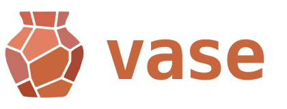

<p align="center">
  
</p>

<p align="center">A cross-platform manual tiling window manager.</p>

<p align="center">
  <a href="https://github.com/CasperTeirlinck/vase/releases/latest"></a>
  <a href="https://github.com/CasperTeirlinck/vase/releases"></a>
  <a href="https://github.com/CasperTeirlinck/homebrew-vase"></a>
  
  
  <a href="LICENSE"></a>
</p>

---

**vase** is a cross-platform\* keyboard-driven manual tiling window manager inspired by tmux.
Vase arranges your windows into **tabs** and **panes** and drives them from a
single prefix key. It's **inspired by tmux**: the same tabs-and-panes model and
modal prefix. Create new windows, split into panes, and group panes into a tabbed **stack**, fully kayboard driven and easy to navigate.

_\* The layout engine is platform-agnostic, but only macOS is available today running on plain Accessibility: no SIP to disable, no injected code, no scripting
additions; Windows and Linux are planned. See [Platforms](#platforms) below._

## Platforms

The layout core (`vase-core`) is platform-agnostic; each OS gets its own thin
backend crate. Only macOS is available today; the others are planned.

| Platform | Backend        | Status      |
| -------- | -------------- | ----------- |
| macOS    | `vase-macos`   | Available   |
| Windows  | `vase-windows` | Coming soon |
| Linux    | `vase-linux`   | Coming soon |

## Features

- **tmux model**: windows as tabs, splits into panes, and nested stacks
  (tabbed containers) inside a pane, up to two levels deep.
- **Multi-monitor**: tabs live per display; send a tab to another monitor in
  one keystroke. Layout survives quit/restart and monitor hotplug.
- **A powerline-style tab bar** no wasted space, with app icons, `prefix-N` numbers for quick switching, dimmed off-monitor
  tabs, and notification-badge dots.
- **Window switcher and pane picker**: searchable trees that mirror your layout hierarchy.

## Install

The macOS backend is what ships today; it needs macOS. Pick whichever of these fits you.

**Homebrew cask** (recommended):

```sh
brew install --cask CasperTeirlinck/vase/vase
```

**Homebrew formula**:

```sh
brew install CasperTeirlinck/vase/vase
```

**Install script** (downloads the latest `vase.app` into `/Applications`):

```sh
curl -fsSL https://raw.githubusercontent.com/CasperTeirlinck/vase/main/install.sh | bash
```

**Manual download**: grab `vase-vX.Y.Z-macos.zip` from the
[latest release](https://github.com/CasperTeirlinck/vase/releases/latest),
unzip it, and move `vase.app` to Applications.

**Build from source** (needs a Rust toolchain and [`just`](https://github.com/casey/just)): `just app` produces `dist/vase.app`,
or `cargo build --release` if you just want the binary.

On first launch, grant **Accessibility** and **Input Monitoring** in System
Settings → Privacy & Security. vase runs as a menu-bar accessory (no Dock icon),
adopts your open windows as tabs on start, and **restores every window to its
original frame on exit**.

## Keys

The prefix is a tmux-style `⌥a` (Option-A): press it, release, then a command key.
A dot at the right of the tab bar turns green while the prefix is armed.

### Tabs

| Key               | Action                                      |
| ----------------- | ------------------------------------------- |
| `⌥a c`            | new tab                                     |
| `⌥a .` / `⌥a ,`   | next / previous tab                         |
| `⌥a 1`-`9`        | jump to tab _n_                             |
| `⌥a t`            | rename the tab                              |
| `⌥a ⇧,` / `⌥a ⇧.` | move the tab left / right                   |
| `⌥a {` / `⌥a }`   | send the tab to the previous / next monitor |
| `⌥a w`            | window switcher                             |
| `⌥a l`            | jump to the last window                     |

### Panes

| Key                           | Action                                     |
| ----------------------------- | ------------------------------------------ |
| `⌥a \` / `⌥a -`               | split right / down (opens the pane picker) |
| `⌥a ← ↑ → ↓`                  | move focus                                 |
| `⌥a ⇧`+arrows / `⌥a ⇧HJKL`    | resize                                     |
| `⌥a ⌘/⌃/⌥`+`HJKL` (or arrows) | move the pane                              |
| `⌥a z`                        | zoom the focused pane                      |
| `⌥a x`                        | break the pane out into its own tab        |

### Stacks

A stack is a tabbed container inside a pane: several windows sharing one slot,
one shown at a time, with a local powerline bar.

| Key               | Action                                  |
| ----------------- | --------------------------------------- |
| `⌥a s`            | make the pane a stack / add a tab to it |
| `⌥a [` / `⌥a ]`   | cycle the focused stack                 |
| `⌥e .` / `⌥e ,`   | cycle the focused stack                 |
| `⌥e 1`-`9`        | select stack item _n_                   |
| `⌥e t`            | rename the stack item                   |
| `⌥e ⇧,` / `⌥e ⇧.` | reorder the stack item                  |

### Command line

`⌥a :` opens a `:` prompt: `:q`, `:rename <name>`, `:close`, `:split`,
`:vsplit`, `:zoom`, `:tab <n>`.

### Pickers

When you open an empty pane or a new tab, a picker appears: type to search,
`j`/`k` or `1`-`9` to choose, `⏎` to move an existing window in or launch an app,
`Esc` to cancel.

## Config

`~/Library/Application Support/vase/config.toml` holds the
app-focus hotkeys: global chords that toggle focus to an app. Press the chord to
bring the app forward, press it again to hide it.

```toml
[[app_focus]]
key = "ctrl+grave"
app = "Ghostty"
```

Chord syntax joins modifiers with `+`, for example `ctrl+grave`, `cmd+shift+k`,
or `alt+space`.

Edit it from the menu bar (**Settings**), then **Reload config** to apply it
without restarting.

## Limitations

- Only the macOS backend exists so far. The core is portable.
- With pure Accessibility, a window can only be raised above another app's
  windows by fronting that app, so bringing a whole split forward can briefly
  flick focus across its panes. That's the trade for not shipping a scripting
  addition.
- A stack holds a flat list of windows; splits inside a stack aren't supported
  yet.
